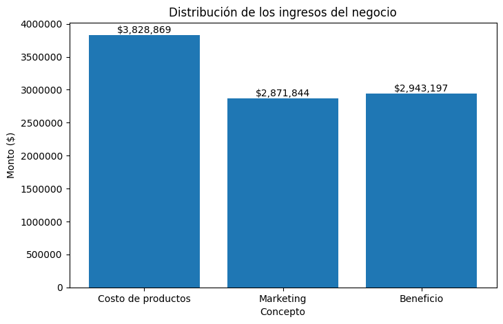
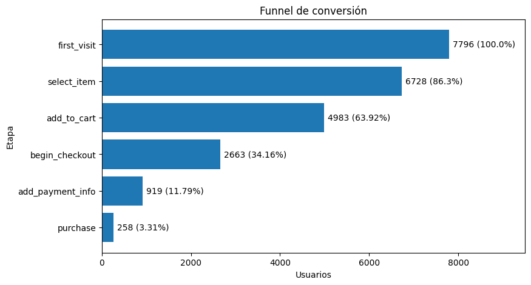
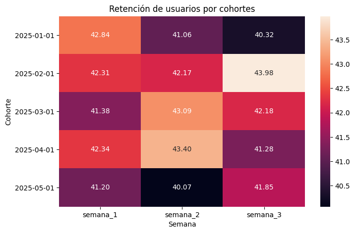
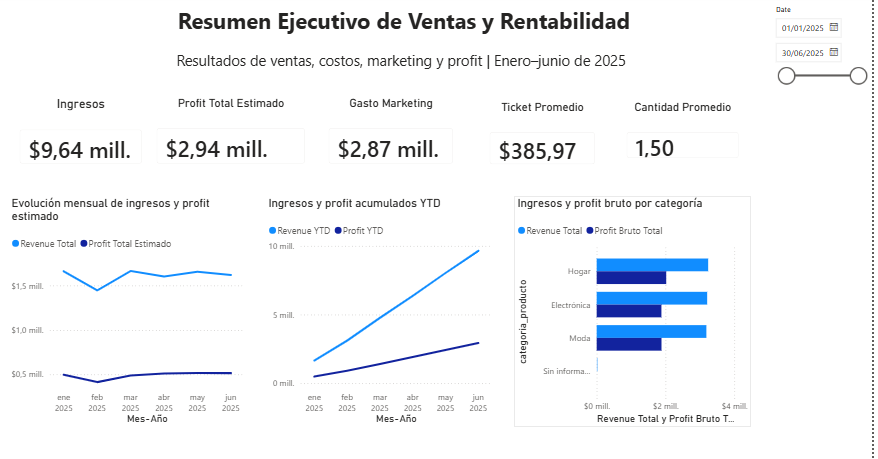

# RappiPlus: De datos a decisiones de negocio

## Objetivo del proyecto

Analizar el desempeño de RappiPlus desde diferentes perspectivas del negocio —ventas, rentabilidad, comportamiento de usuarios, retención y conversión— con el fin de identificar oportunidades de mejora y generar recomendaciones basadas en datos.

El proyecto integra análisis con **Python, SQL, estadística y Power BI**, siguiendo un proceso completo desde la preparación de los datos hasta la comunicación de resultados.

---

## Preguntas de negocio

El análisis busca responder principalmente:

- ¿El negocio es rentable?
- ¿En qué etapas del proceso de compra se pierden más usuarios?
- ¿Los usuarios regresan después de registrarse?
- ¿Un cambio en la experiencia de checkout mejora significativamente la conversión?
- ¿Cómo comunicar los principales resultados de manera clara para la toma de decisiones?

---

## Proceso de análisis

1. Limpieza, validación y preparación de los datos con Python.
2. Análisis de ingresos, costos, marketing y rentabilidad.
3. Construcción de un funnel de conversión con SQL.
4. Análisis de retención de usuarios mediante cohortes.
5. Evaluación de una prueba A/B con análisis estadístico.
6. Construcción de un dashboard ejecutivo en Power BI.

---

## Resultados de negocio

El análisis de rentabilidad mostró:

- **Ingresos totales:** $9.643.909,56
- **Costos totales:** $3.828.869,01
- **Inversión en marketing:** $2.871.843,53
- **Beneficio estimado:** $2.943.197,02
- **Margen de beneficio:** 30,52 %
- **Ticket promedio:** $385,97
- **Cantidad promedio de productos por pedido:** 1,5



---

## Funnel de conversión

Se analizó el recorrido de los usuarios a través de las etapas:

`first_visit → select_item → add_to_cart → begin_checkout → add_payment_info → purchase`

De **7.796 usuarios** que iniciaron el funnel, solamente **258 completaron una compra**, equivalente a una conversión global del **3,31 %**.

El análisis permite identificar los puntos de mayor fricción y priorizar etapas del proceso de compra que pueden requerir optimización.



La consulta SQL utilizada está disponible en:

[`sql/funnel_conversion.sql`](sql/funnel_conversion.sql)

---

## Retención por cohortes

Los usuarios fueron agrupados por mes de registro y se analizó su actividad después de **7, 14 y 21 días**.

Las cohortes presentan tasas de retención cercanas al **40–44 %**, mostrando un comportamiento relativamente estable durante las primeras semanas, aunque con diferencias entre meses que pueden seguir monitoreándose.



Consulta SQL:

[`sql/cohort_retention.sql`](sql/cohort_retention.sql)

---

## Prueba A/B

Se evaluó si una variante del proceso de checkout generaba una mejora significativa en la conversión.

- Conversiones: **779 control / 820 tratamiento**
- Usuarios: **4.965 control / 5.035 tratamiento**
- Estadístico Z: **-0,8133**
- Valor p: **0,4161**

El resultado indica que **no existe evidencia estadísticamente suficiente para afirmar que la nueva variante produjo una mejora significativa en la conversión**.

Este resultado también es útil para el negocio: evita tomar decisiones basadas únicamente en pequeñas diferencias observadas sin respaldo estadístico.

---

## Dashboard en Power BI

Para comunicar los resultados se desarrolló un dashboard ejecutivo con indicadores de ventas y rentabilidad.

Incluye KPIs de:

- Ingresos
- Profit estimado
- Gasto de marketing
- Ticket promedio
- Cantidad promedio
- Evolución mensual
- Resultados por categoría



---

## Principales insights

- El negocio presenta un **margen estimado del 30,52 %**, mostrando rentabilidad positiva en el periodo analizado.
- La conversión global del funnel es de solo **3,31 %**, por lo que existe margen para mejorar la experiencia antes de la compra.
- La retención se mantiene aproximadamente entre **40 % y 44 %** durante las primeras semanas.
- El experimento A/B no mostró una diferencia estadísticamente significativa, por lo que no se recomienda atribuir la variación observada únicamente al cambio evaluado.

---

## Recomendaciones

- Analizar con mayor profundidad las etapas con mayor pérdida de usuarios dentro del funnel.
- Priorizar mejoras en checkout y pago mediante nuevos experimentos controlados.
- Monitorear la evolución de la retención por cohortes para identificar cambios en el comportamiento de usuarios.
- Mantener seguimiento de ingresos, costos, marketing y margen mediante el dashboard ejecutivo.
- Utilizar pruebas estadísticas antes de implementar cambios de producto a gran escala.

---

## Herramientas utilizadas

- **Python:** Pandas, NumPy, Matplotlib, Seaborn
- **SQL:** CTE, joins, agregaciones, funnel y cohortes
- **Estadística:** prueba Z de proporciones y análisis A/B
- **Power BI:** modelado, DAX, KPIs y visualización
- **Jupyter Notebook**

---

## Estructura del repositorio

```text
├── README.md
├── notebooks/
│   └── rappiplus_análisis_de_negocios.ipynb
├── sql/
│   ├── funnel_conversion.sql
│   └── cohort_retention.sql
└── images/
    ├── rentabilidad_negocio.png
    ├── funnel_conversion.png
    ├── retencion_cohortes.png
    └── dashboard_powerbi.png
